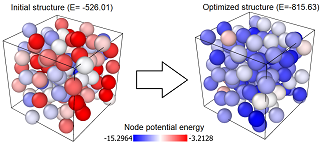

## StriderNet: A Graph Reinforcement Learning Approach to Optimize Atomic Structures on Rough Energy Landscapes

Click [here](https://proceedings.mlr.press/v202/bihani23a) to get the full paper.


Click [here](https://www.youtube.com/watch?v=wrQmLkqEegI) to watch a cool demo video.

[](https://www.youtube.com/watch?v=wrQmLkqEegI)

## Abstract
Optimization of atomic structures presents a challenging problem, due to their highly rough and non-convex energy landscape, with wide applications in the fields of drug design, materials discovery, and mechanics. Here, we present a graph reinforcement learning approach, StriderNet, that learns a policy to displace the atoms towards low energy configurations. We evaluate the performance of StriderNet on three complex atomic systems, namely, binary Lennard-Jones particles, calcium silicate hydrates gel, and disordered silicon. We show that StriderNet outperforms all classical optimization algorithms and enables the discovery of a lower energy minimum. In addition, StriderNet exhibits a higher rate of reaching minima with energies, as confirmed by the average over multiple realizations. Finally, we show that StriderNet exhibits inductivity to unseen system sizes that are an order of magnitude different from the training system.
    
   
## Authors
	-Vaibhav Bihani, Deparment of Civil Engineering, Indian Institute of Technology Delhi, Hauz Khas, New Delhi, India 110016
	-Sahil Manchanda,Department of Computer Science and Engineering,Indian Institute of Technology Delhi, Hauz Khas, New Delhi, India 110016
	-Sayan Ranu∗,Department of Computer Science and Engineering,Indian Institute of Technology Delhi, Hauz Khas, New Delhi, India 110016 and,Yardi School of Artificial Intelligence, Indian Institute of Technology Delhi, Hauz Khas, New Delhi, India 110016
	-N. M. Anoop Krishnan†, Department of Civil Engineering, Indian Institute of Technology Delhi, Hauz Khas, New Delhi, India 110016 and, Yardi School of Artificial Intelligence, Indian Institute of Technology Delhi, Hauz Khas, New Delhi, India 110016

## Environment settings
    python      > 3.7
    jax         > 0.4.1                 
    jax-md      > 0.2.24                 
    jaxlib      > 0.4.1                 
    flax        > 0.6.3                 
    jraph       > 0.0.6.dev0            
    optax       > 0.1.4                 

**Example Usage**

To run the training of model :
```
python -u -m src.Train.py
```

